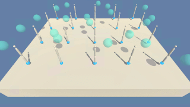
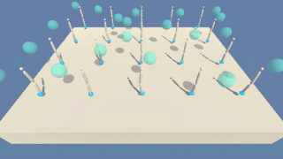
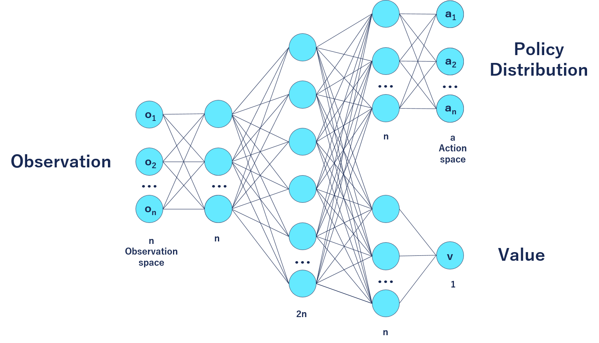

# Continuous Control with PPO

---

This notebook will present a flexible and simple implementation of the PPO reinforcement learning algorithm to solve the Reacher environment provided by [Unity Technologies ML Agents](https://github.com/Unity-Technologies/ml-agents/blob/master/docs/Learning-Environment-Examples.md#reacher).

Part of the code has been inspired and tested against the PPO implementation from [Ilya Kostrikov](https://github.com/ikostrikov/pytorch-a2c-ppo-acktr-gail/tree/master/a2c_ppo_acktr).

Untrained Agent        | Trained Agent
:---------------------:|:-----------------------:
  | 

### The environment

Double-jointed arms move in the environment towards targets represented by spheres. The goal is to maximize the time each agent "hand" spend in the sphere (+0.1 reward per time step).

The environment is considered solved when the average score of all agents reaches an average of 30.0 over the last 100 episodes.

The Reacher environment can be downloaded here:

- [Linux](https://s3-us-west-1.amazonaws.com/udacity-drlnd/P2/Reacher/Reacher_Linux.zip)
- [Mac OSX](https://s3-us-west-1.amazonaws.com/udacity-drlnd/P2/Reacher/Reacher.app.zip)
- [Windows (32-bit)](https://s3-us-west-1.amazonaws.com/udacity-drlnd/P2/Reacher/Reacher_Windows_x86.zip)
- [Windows (64-bit)](https://s3-us-west-1.amazonaws.com/udacity-drlnd/P2/Reacher/Reacher_Windows_x86_64.zip)

### Required Libraries

The following libraries and dependencies are used:

1. [Python 3.6](https://www.python.org/downloads/)
2. [Unity ML-Agents](https://github.com/Unity-Technologies/ml-agents/blob/master/docs/Installation.md)
3. [NumPy](http://www.numpy.org/)
4. [Pytorch 1.3](https://pytorch.org/)

And the following files has been defined:

1. agent.py : Contains the implementation of Random and PPO agents.
2. coach.py : Contains a function to run the environment with a specified agent and define the structure to learn from the environment.
3. model.py : Containes the defenition of the actor-critic model used by the PPO agents.

### The PPO Actor-Critic model

The model of the agent will consist of a double-headed Actor-Critic trained by the [Proximal Policy Optimization](https://arxiv.org/abs/1707.06347) algorithm:

---

---

### Ideas for future work

1. While the environment is able to be solved within less than 1000 episodes, the hyper-parameters haven't been tuned. Some adjustments can be done in the Settings and Parameters section.
  
2. Some observations could be joined together as the input of the policy. This could help the neural network learn about speed and acceleration and could help with the precision of the hand position.
  
3. Implementing an RNN model instead of the actual MLP as the agent's model could maybe provide faster converging results.
  
4. Once the policy has been trained on the multiple agents environment it would be interesting to test the agent on the single agent environment. In a real-life scenario, training a policy over multiple agents can facilitate and accelerate training, but most of the time, the deployed policy will act on a single machine.
  
5. The actual PPO agent doesn't really <i>understand</i> what it is doing. It only tries to maximize rewards by adjusting actions without understanding the impact of those. It would be interesting to add a loss for the next state(s?) prediction in order for the agent to understand action-reaction.